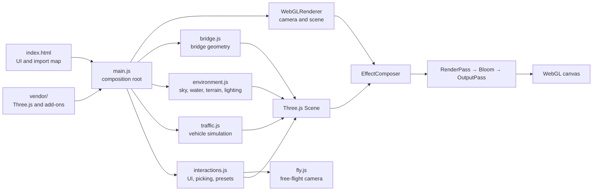
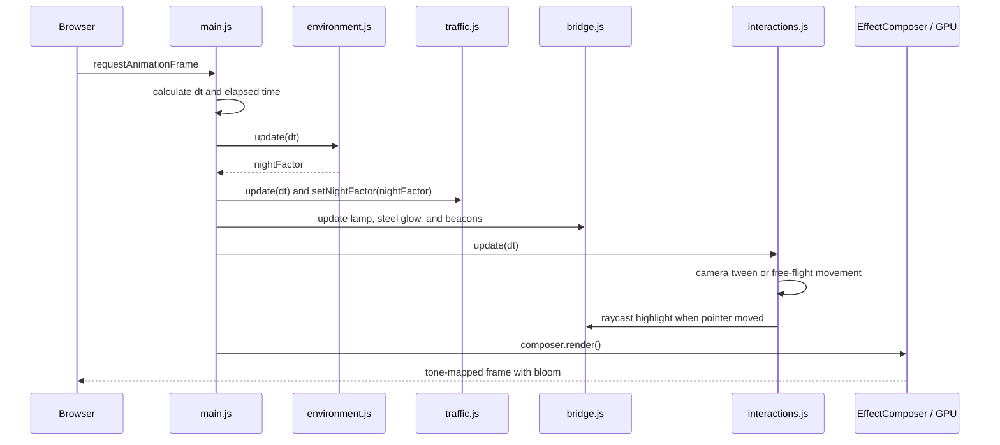
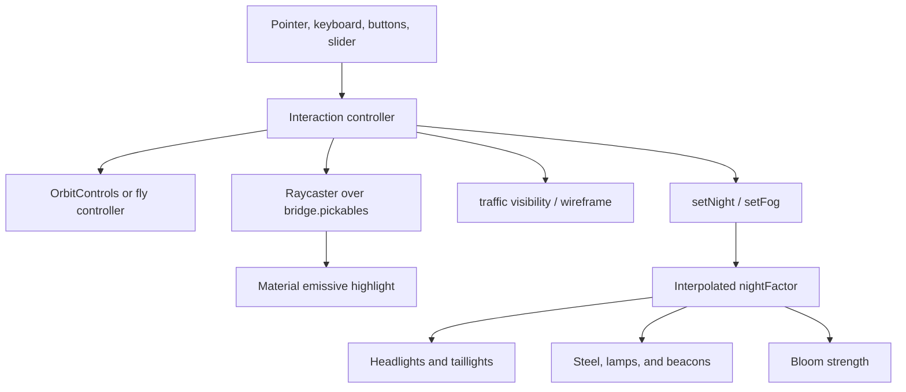
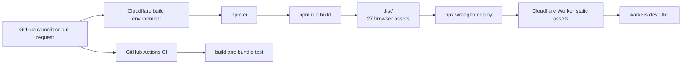

# Golden Gate Bridge — Interactive 3D

<!-- markdownlint-disable MD013 -->

An interactive, browser-based recreation of San Francisco's Golden Gate Bridge. The scene is generated at runtime with Three.js: the bridge geometry is procedural, the Bay and sky are animated, traffic moves across six lanes, and the camera supports both orbit and free-flight navigation.

**Live site:** [golden-gate-bridge.chunhualiao.workers.dev](https://golden-gate-bridge.chunhualiao.workers.dev/)

This project was originally vibe-coded with the latest **Kimi K3** model available at the time, then tested and prepared for deployment on Cloudflare Workers.

For a measured comparison of Kimi's active development time, token usage, API-equivalent cost, and estimated manual engineering effort, see the [AI Development Economics Report](AI_DEVELOPMENT_ECONOMICS.md).

## Highlights

- A scale-conscious suspension bridge model where one scene unit represents one metre
- Procedural towers, cables, suspenders, trusses, road markings, anchorages, lamps, and beacons
- Procedural terrain for the Marin Headlands, Presidio, Fort Point, Angel Island, and Alcatraz
- Animated water, atmospheric fog, physical sky lighting, stars, and a smooth day/night transition
- Forty-six moving vehicles rendered efficiently with instanced meshes
- Orbit navigation, free-flight controls, four cinematic camera presets, and object inspection
- HDR bloom and ACES filmic tone mapping
- No application framework or runtime package download: browser modules are served directly from `vendor/`

## System architecture

`main.js` is the composition root. It creates the renderer, scene, camera, controls, and post-processing pipeline, then asks each feature module to build and manage its part of the world.



### Runtime frame flow

The application uses one `requestAnimationFrame` loop. Each frame is capped at a 50 ms delta to prevent large simulation jumps after a suspended or backgrounded tab resumes.



### State and control flow

The feature modules expose small controller objects rather than sharing global mutable state. `main.js` coordinates cross-feature effects—for example, the environment's `nightFactor` drives vehicle lights, bridge illumination, lamp opacity, and bloom intensity.



## How the main pieces work

| Component | Responsibility | Important implementation details |
| --- | --- | --- |
| `index.html` | Page shell and controls | Contains the heads-up display and an import map that resolves `three` and its add-ons to vendored files. |
| `main.js` | Application lifecycle | Configures WebGL, builds each subsystem, handles resize, runs the animation loop, and coordinates night effects. |
| `bridge.js` | Bridge model | Builds the bridge from Three.js primitives, curves, and instanced meshes. It also owns pickable objects, highlight materials, lamps, and warning beacons. |
| `environment.js` | World and atmosphere | Generates terrain with deterministic fractal value noise; creates water, sky, fog, skyline, stars, and lights; interpolates day/night presets. |
| `traffic.js` | Traffic simulation | Updates 46 cars across six lanes. Bodies, cabins, headlights, and taillights are instanced to keep draw calls low. |
| `interactions.js` | User interaction | Handles camera presets, raycasting, information cards, scene toggles, fog, and the switch between orbit and fly modes. |
| `fly.js` | Free-flight camera | Tracks yaw/pitch and pressed keys, applies frame-rate-independent movement, and supports a speed boost and wheel-controlled base speed. |
| `vendor/` | Browser dependencies | Contains Three.js, OrbitControls, post-processing passes, sky/water objects, shaders, and the water-normal texture. |
| `scripts/build.mjs` | Deployment staging | Recreates `dist/` with only browser assets, preventing development dependencies from being uploaded to Cloudflare. |
| `wrangler.jsonc` | Cloudflare configuration | Deploys `dist/` as static Worker assets with SPA-style fallback behavior. |

## Scene model

The coordinate system uses metres:

- `x`: distance along the bridge, with the towers at `x = ±640`
- `y`: elevation, with water at `y = 0` and the roadway at `y = 67`
- `z`: width across the bridge

The main span is 1,280 m. Cable height is calculated by `cableY(x)`: a parabola spans the towers, while the side spans use a slightly drooped interpolation toward the anchorages. Suspenders are placed every 15.24 m (50 ft) and extend from the calculated cable height to the deck.

Many repeated details—suspenders, truss members, tower ribs, lamps, skyline buildings, and vehicles—use `THREE.InstancedMesh`. This allows many objects to share one geometry and material while retaining individual transforms.

Textures for steel, asphalt, and concrete are painted into in-memory canvases during module initialization. Terrain uses seeded noise and is deterministic; vehicle positions, vehicle colours, texture speckles, stars, and skyline details intentionally vary between page loads because they use `Math.random()`.

## Rendering pipeline

The browser renders through this sequence:

1. `WebGLRenderer` draws an antialiased, shadow-enabled scene.
2. `RenderPass` renders into a half-float multisampled target.
3. `UnrealBloomPass` adds restrained daytime bloom and stronger night bloom.
4. `OutputPass` applies the final colour conversion.
5. ACES filmic tone mapping and the current environment exposure produce the displayed image.

Pixel ratio is capped at `2` to balance sharpness and GPU cost. The directional-light shadow map is 4096×4096, so integrated GPUs and mobile devices may be more sensitive to the scene's rendering cost.

## Controls

| Action | Control |
| --- | --- |
| Orbit | Left-drag |
| Zoom | Mouse wheel |
| Pan | Right-drag |
| Camera presets | Buttons or keys `1`–`4` |
| Enter free-flight mode | Select **Fly (WASD)** |
| Move in free flight | `WASD` or arrow keys |
| Move vertically | `Q` / `E` or `Space` for up |
| Look in free flight | Left-drag |
| Fly faster | Hold `Shift` |
| Change fly speed | Mouse wheel |
| Inspect bridge components | Hover, then click |
| Close an information card | `Escape` or the close button |

The scene panel also controls night mode, automatic orbit, traffic visibility, wireframe rendering, and fog density.

## Run locally

Requirements:

- Node.js 22 or later for the build and test tooling
- A modern browser with WebGL 2 support
- Python 3, or any static HTTP server, for local serving

Install dependencies:

```bash
npm ci
```

Serve the source tree directly:

```bash
python3 -m http.server 8123
```

Then open [http://localhost:8123](http://localhost:8123). Do not open `index.html` as a `file://` URL: browser module and texture loading requires HTTP.

## Build and test

Create the deployment bundle and validate its contents:

```bash
npm run build
npm test
```

The test verifies that `dist/` contains every required browser asset, excludes development files such as `node_modules` and `.mjs` scripts, and contains no file larger than Cloudflare's 25 MiB asset limit.

Two Puppeteer scripts are also available for hands-on browser checks:

- `shoot.mjs` captures a set of scene screenshots.
- `test-fly.mjs` exercises free-flight camera movement.

They expect the site to be available locally; inspect the script before running it to confirm the configured port and output path.

For debugging in the browser console, the application exposes selected controllers as `window.__gg`:

```js
window.__gg.camera
window.__gg.controls
window.__gg.env
window.__gg.bridge
window.__gg.fly
```

## Deployment

Cloudflare's Git integration uses:

| Setting | Value |
| --- | --- |
| Build command | `npm run build` |
| Deploy command | `npx wrangler deploy` |
| Root directory | `/` |
| Static asset directory | `./dist` |

The delivery path is:



For a manual deployment:

```bash
npm ci
npm run build
npx wrangler deploy
```

`dist/` is generated and ignored by Git. Do not point Wrangler at the repository root: doing so includes `node_modules` and can exceed Cloudflare's per-asset size limit.

## Troubleshooting

### The page is blank or modules fail to load

Serve the project over HTTP and check the browser console. Confirm that the `vendor/` directory is present and paths in the import map still match its contents.

### The scene renders slowly

The largest costs are the high-resolution shadow map, water rendering, post-processing, and a retina pixel ratio up to 2. Reduce those settings in `main.js` or `environment.js` when targeting lower-power devices.

### Camera movement feels stuck

Check whether Orbit or Fly mode is selected. OrbitControls is intentionally disabled during free flight and camera preset tweens so it cannot overwrite the camera orientation.

### Cloudflare reports an oversized asset

Confirm that `npm run build` ran and that `wrangler.jsonc` still points to `./dist`. A deployment that scans the repository root will also scan installed development dependencies.

### Night lighting does not appear immediately

Day/night changes interpolate over roughly 1.1 seconds. The environment map is rebaked periodically during the transition, and vehicle lights remain hidden until the night factor exceeds a small threshold.

## Project structure

```text
.
├── index.html                 # UI, styles, canvas, and import map
├── main.js                    # Renderer, composition, and animation loop
├── bridge.js                  # Procedural bridge geometry and materials
├── environment.js             # Sky, water, terrain, fog, and lighting
├── traffic.js                 # Instanced vehicle simulation
├── interactions.js            # Picking, UI controls, and camera presets
├── fly.js                     # Free-flight camera controller
├── vendor/                    # Vendored Three.js runtime assets
├── scripts/build.mjs          # Creates the deployable dist/ directory
├── test/build-output.test.mjs # Validates the deployment bundle
├── .github/workflows/ci.yml   # GitHub Actions build and test workflow
├── wrangler.jsonc             # Cloudflare Workers asset configuration
└── package.json               # Tooling dependencies and scripts
```

## License

ISC, as declared in `package.json`.
